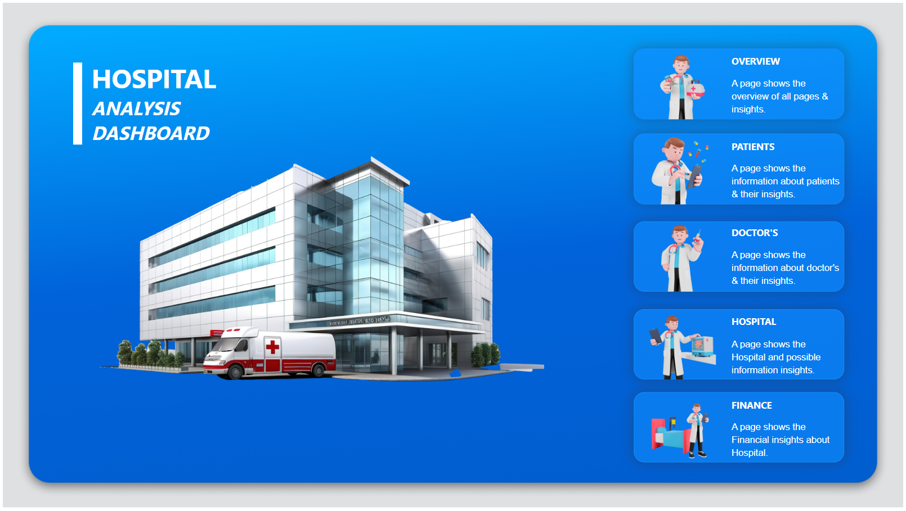
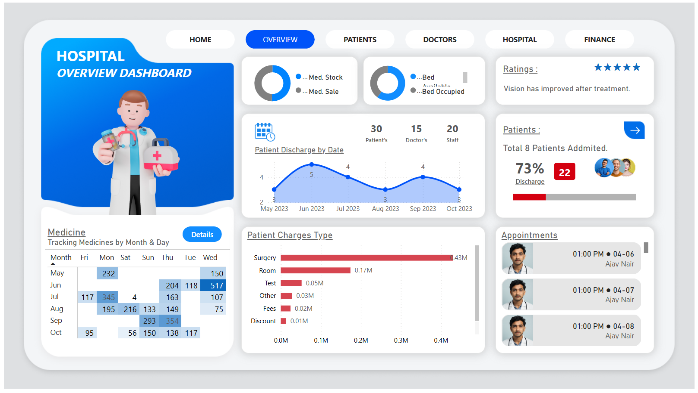
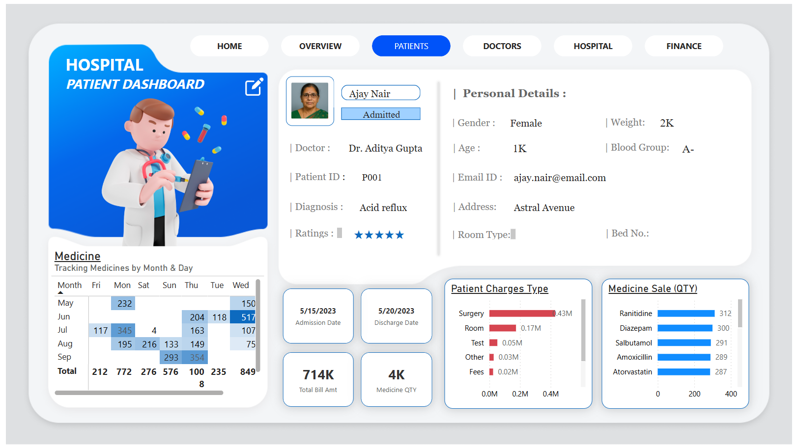
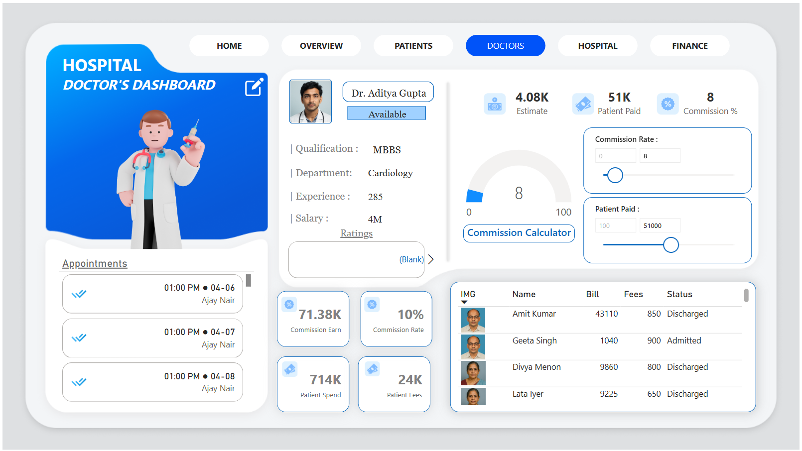
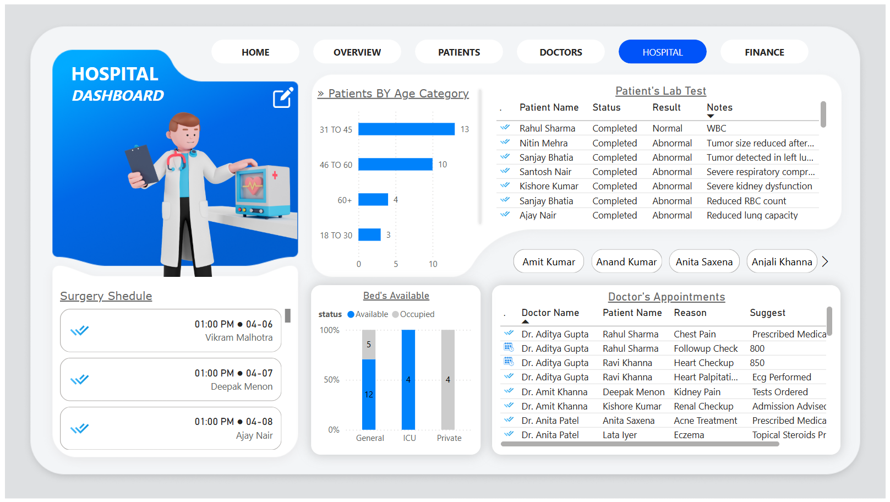
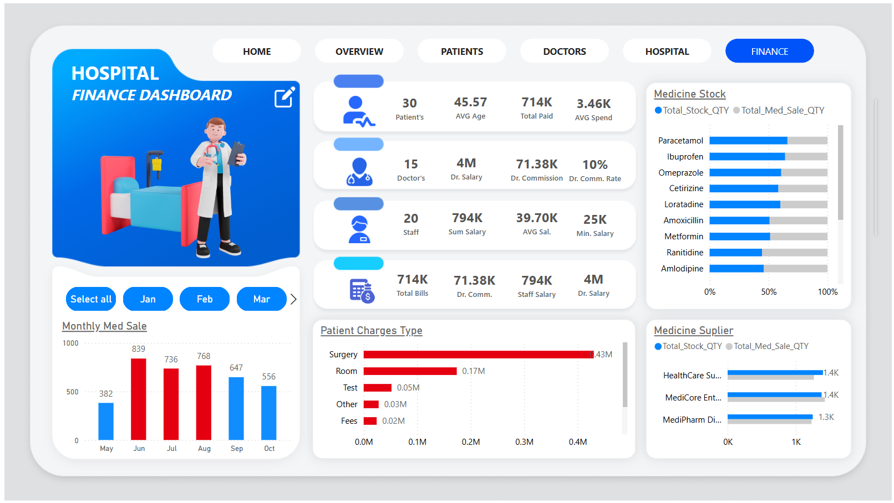

# 🏥 Hospital Analysis Dashboard | Power BI Project

## 🔗 Live Interactive Dashboard
👉 **View Live Dashboard:**  
https://YOUR_GITHUB_USERNAME.github.io/hospital-powerbi-dashboard/

---

## 📌 Project Overview
This project is an **end-to-end Hospital Analysis Dashboard** built using **Power BI** to monitor hospital operations, patient data, doctor performance, and financial insights.

The dashboard helps hospital management make **data-driven decisions** by visualizing key healthcare KPIs.

---

## 🧩 Dashboard Pages

### 🟦 1. Overview Dashboard
- Hospital performance summary
- Total patients, doctors, staff
- Bed availability & occupancy
- Patient discharge trends
- Medicine stock vs sales

---

### 🧑‍⚕️ 2. Patient Dashboard
- Patient personal details
- Diagnosis & treatment details
- Admission & discharge dates
- Medicine usage
- Patient bill amount & ratings

---

### 👨‍⚕️ 3. Doctor Dashboard
- Doctor profile & availability
- Qualification & experience
- Commission calculation
- Patient payment details
- Appointment schedule

---

### 🏥 4. Hospital Dashboard
- Patients by age category
- Lab test results & status
- Surgery schedule
- Bed availability (General / ICU / Private)
- Doctor-wise appointments

---

### 💰 5. Finance Dashboard
- Total hospital bills & revenue
- Doctor & staff salary analysis
- Medicine stock vs sales
- Monthly medicine sales
- Supplier-wise medicine distribution

---

## 📊 Tools & Technologies Used
- **Power BI**
- **DAX**
- **Power Query**
- **Excel / CSV Dataset**
- **HTML**
- **GitHub Pages**

---

## 📂 Project Structure
POWER-BI_Hospital_Analysis_Dashboard/
│
├── index.html
├── README.md
├── screenshots/
|
| ├── Main.png
│ ├── Overview.png
│ ├── Patient.png
│ ├── Doctor.png
│ ├── Hospital.png
│ └── Finance.png
│
├── Dataset/
|
│ ├── appointments.csv
| ├── beds_info.csv
| ├── bills.csv
| ├── medical_stock_info.csv
| ├── medicine_patients.csv
| ├── patient_info.csv
| ├── patient_test.csv
| └── staff.csv
│
└── pbix/
  └── Hospital_Analysis_Dashboard.pbix

---

## 🖼 Dashboard Screenshots

### Main Page

### Overview Page

### Patient Page

### Doctor Page

### Hospital Page

### Finance Page

---

## 🚀 How to Use
1. Open the **Live Dashboard link**
2. Navigate through pages using tabs
3. Apply filters & slicers
4. Interact with visuals for insights

---

## 🎯 Key Learning Outcomes
- Real-world healthcare data modeling
- KPI creation using DAX
- Dashboard UI/UX design
- Business storytelling using data
- Publishing & hosting dashboards online

---

##  Author
**Bhushan Chaudhari**  
| Aspiring Data Analyst   

🔗 LinkedIn: https://linkedin.com/in/bhushan-chaudhari-958945264  
📂 GitHub: https://github.com/chaudharibhushan2040
